# Helio Project - Comprehensive Diagrams

This document contains diagram codes for all architecture, flow, and system diagrams for the Helio Solana Wallet application. Use these with text-to-diagram tools like Mermaid.

---

## 1. Complete Project Diagram (System Overview)

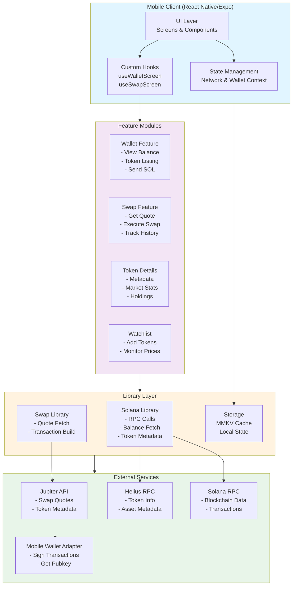

---

## 2. ER Diagram (Entity Relationship)

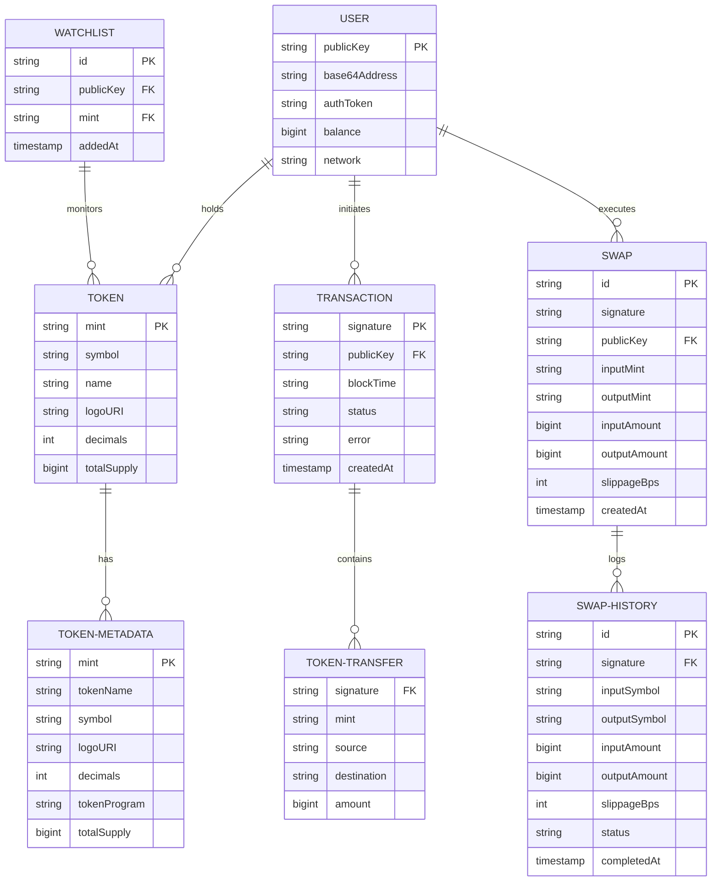

---

## 3. UML Class Diagram

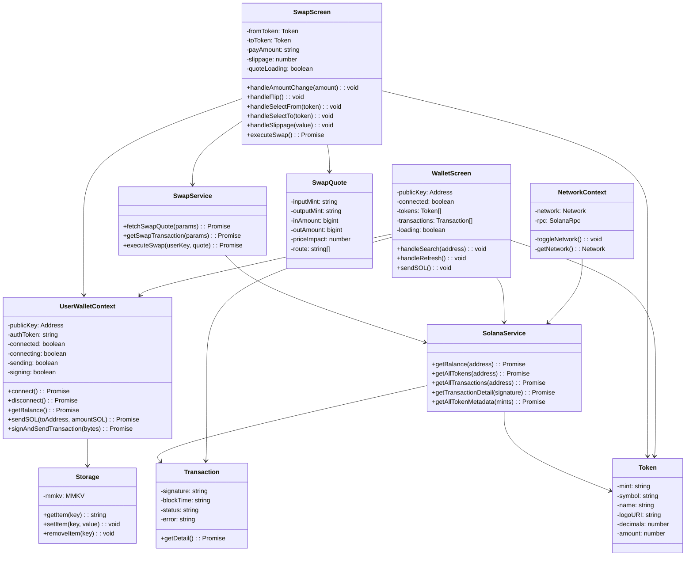

---

## 4. UML Sequence Diagram - User Wallet Connection

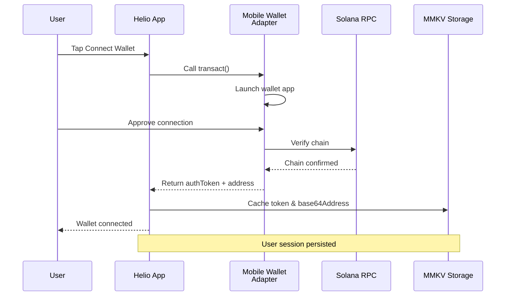

---

## 5. UML Sequence Diagram - Token Balance Fetch

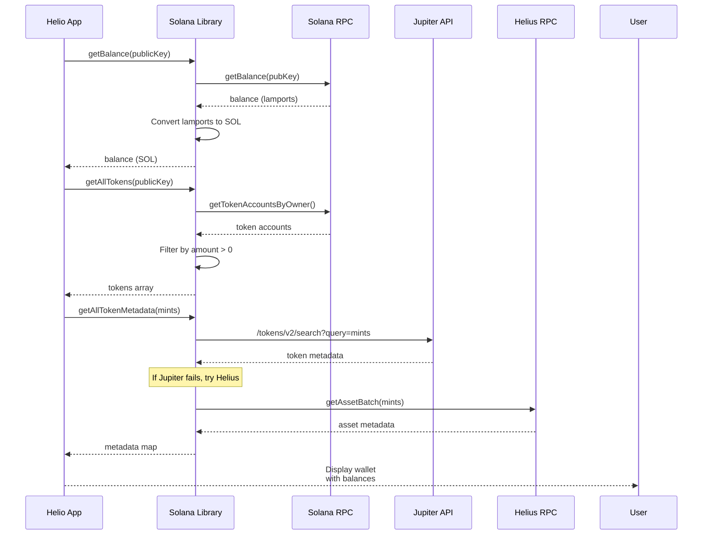

---

## 6. UML Sequence Diagram - Swap Execution

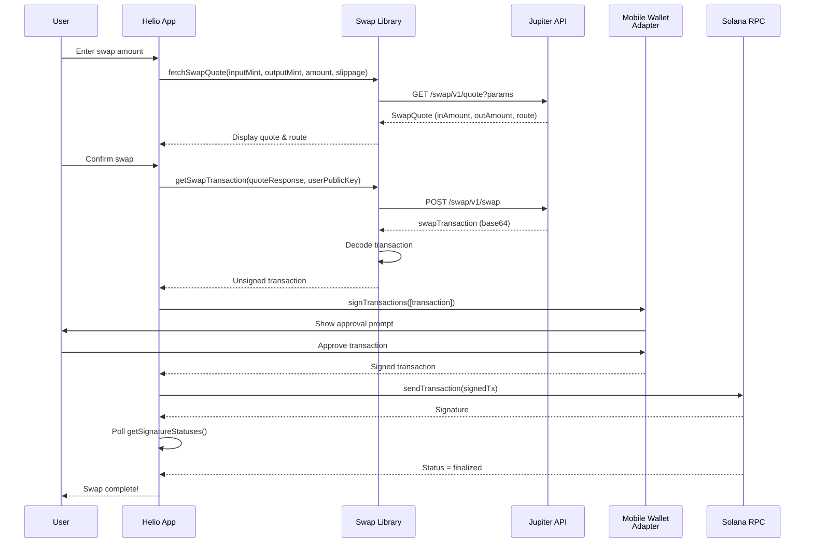

---

## 7. UML Sequence Diagram - Send SOL

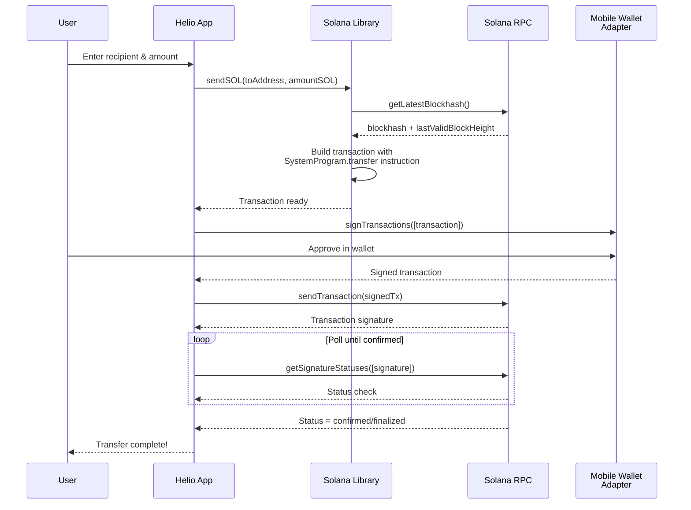

---

## 8. UML Activity Diagram - Token Balance Fetch Activity

```mermaid
activity
    start
    :Enter wallet address;
    :Validate public key;
    if (valid?) then (no)
        :Show error;
        stop
    else (yes)
        :Fetch SOL balance from RPC;
        :Fetch token accounts from RPC;
        :Extract token mints;
        :Batch fetch token metadata from Jupiter;
        if (Jupiter succeeds?) then (no)
            :Try Helius API;
        else (yes)
        endif
        :Map metadata to tokens;
        :Sort by balance;
        :Cache results in MMKV;
        :Update UI with tokens;
    endif
    stop
```

---

## 9. UML Activity Diagram - Swap Execution Flow

```mermaid
activity
    start
    :User enters swap amounts;
    :Select input & output tokens;
    :Set slippage tolerance;
    :Request quote from Jupiter;
    if (Quote available?) then (yes)
        :Display swap preview;
        :Show price impact;
        if (User confirms?) then (yes)
            :Authorize wallet session;
            :Fetch latest blockhash;
            :Request swap transaction from Jupiter;
            if (Transaction ready?) then (yes)
                :Show approval in wallet;
                if (User approves?) then (yes)
                    :Sign transaction via MWA;
                    :Send transaction to RPC;
                    :Poll for confirmation;
                    if (Confirmed?) then (yes)
                        :Store in swap history;
                        :Show success;
                    else (no)
                        :Show timeout error;
                    endif
                else (no)
                    :Show rejection;
                endif
            else (no)
                :Show build error;
            endif
        else (no)
            :Dismiss;
        endif
    else (no)
        :Show quote error;
        :Retry option;
    endif
    stop
```

---

## 10. Data Flow Diagram - Level 0 (System Context)

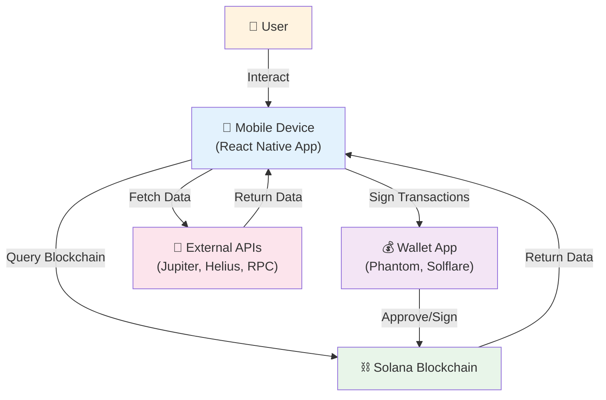

---

## 11. Data Flow Diagram - Level 1 (Main System Process)

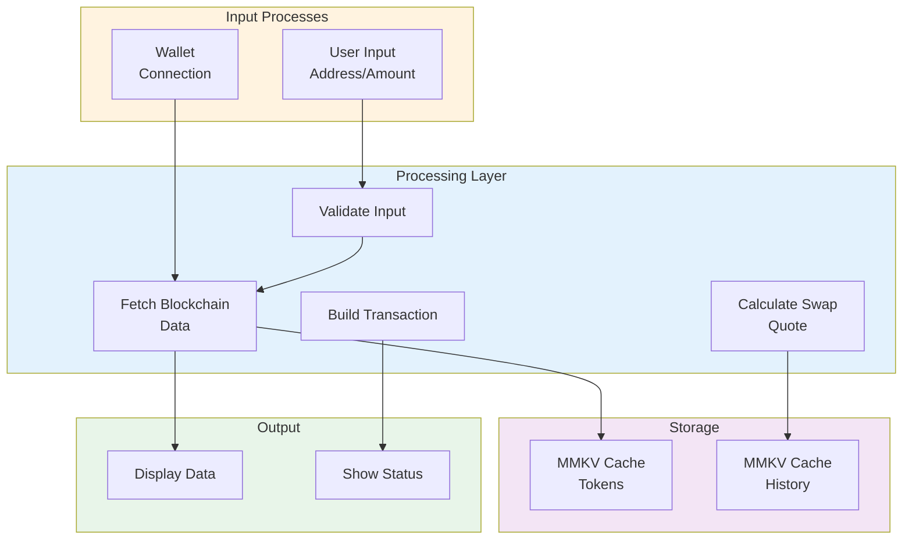

---

## 12. Data Flow Diagram - Level 2 (Detailed Process View)

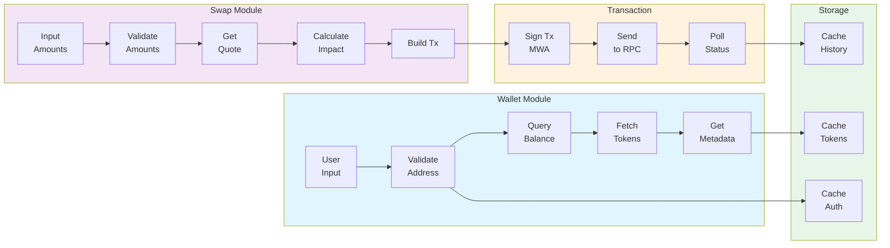

---

## 13. Data Flow Diagram - Level 3 (Detailed Subprocess Decomposition)

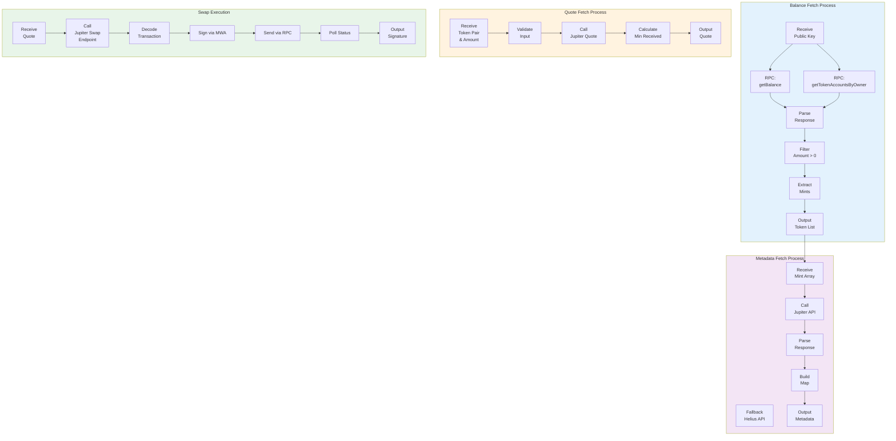

---

## 14. Use Case Diagram

```mermaid
usecase UC1 as Connect Wallet
usecase UC2 as View Balance
usecase UC3 as View Tokens
usecase UC4 as View Token Details
usecase UC5 as Send SOL
usecase UC6 as Swap Tokens
usecase UC7 as View History
usecase UC8 as View Watchlist
usecase UC9 as Switch Network
usecase UC10 as Search Wallet

actor User

User --> UC1
User --> UC9

UC1 --> UC2
UC1 --> UC10

UC10 --> UC3
UC10 --> UC7

UC3 --> UC4
UC3 --> UC5
UC3 --> UC6
UC3 --> UC8

UC6 --> UC7
UC5 --> UC7

UC4 --> UC8

UC2 ..> UC1 : requires

UC6 ..> UC2 : checks balance
UC5 ..> UC2 : checks balance

UC9 ..> UC2 : affects data

rect rgb(200, 150, 255)
    note right of UC6, UC5
        Requires wallet connection
    end rect
```

---

## 15. Component Interaction Diagram

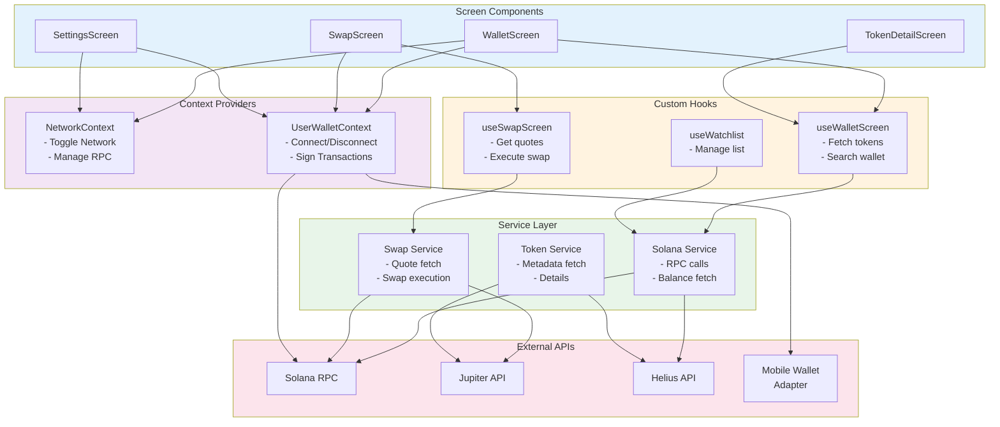

---

## 16. State Management Diagram

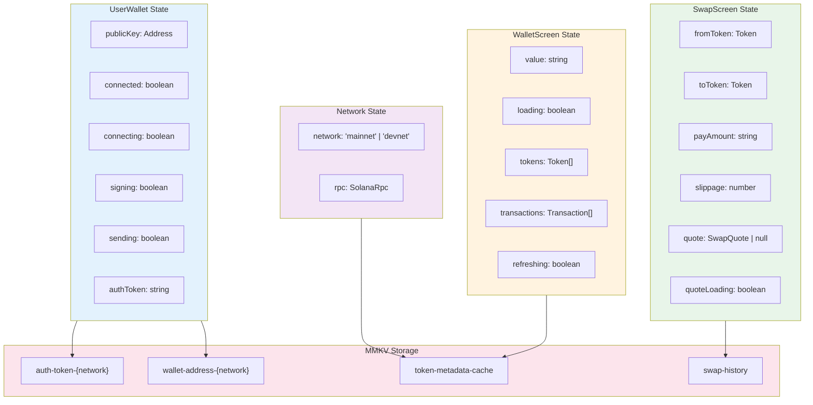

---

## Usage Instructions

### For Mermaid Diagrams:
1. **Online**: Use [Mermaid Live Editor](https://mermaid.live)
2. **In Documentation**: Add code blocks with ` ```mermaid ` syntax
3. **In Notion/Confluence**: Use respective diagram plugins
4. **Generate as Images**: Use `mermaid-cli` package

### Installation & Usage:
```bash
npm install -g @mermaid-js/mermaid-cli

# Generate PNG
mmdc -i diagram.md -o diagram.png

# Generate SVG
mmdc -i diagram.md -o diagram.svg -t forest
```

### Themes:
- `default` - Light theme
- `forest` - Green theme
- `dark` - Dark theme
- `neutral` - Neutral theme

---

## Diagram Summary

| Diagram | Purpose | Type | Audience |
|---------|---------|------|----------|
| 1. Complete Project | System overview | Graph | Everyone |
| 2. ER Diagram | Data model | Entity Relationship | Developers, DBAs |
| 3. UML Class | Object design | Class Diagram | Developers |
| 4. Sequence - Connection | Wallet flow | Sequence | Developers |
| 5. Sequence - Balance | Data fetch flow | Sequence | Developers |
| 6. Sequence - Swap | Swap execution | Sequence | Developers |
| 7. Sequence - Send SOL | Transfer flow | Sequence | Developers |
| 8. Activity - Balance | Process steps | Activity | Business Analysts |
| 9. Activity - Swap | Process flow | Activity | Business Analysts |
| 10. DFD Level 0 | System context | Data Flow | Stakeholders |
| 11. DFD Level 1 | Main processes | Data Flow | Architects |
| 12. DFD Level 2 | Detailed modules | Data Flow | Developers |
| 13. DFD Level 3 | Subprocess detail | Data Flow | Developers |
| 14. Use Cases | User interactions | Use Case | Product Managers |
| 15. Component Interaction | Module relationships | Component | Developers |
| 16. State Management | App state | State Diagram | Frontend Developers |

---

Generated for Helio Solana Wallet Project
